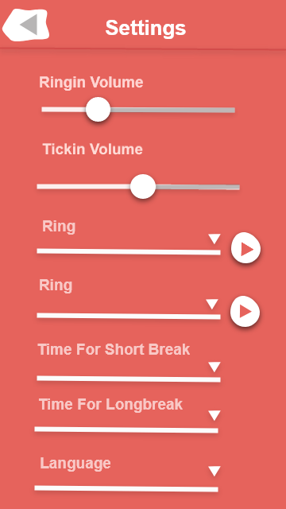

# 🍅 Android Pomodoro Productivity Timer

Android Pomodoro Productivity Timer is a simple, easy-to-use, and effective productivity timer.
## ⏰ Description
The pomodoro technique is a personal time management method:
1. Work uninterrupted for 25 minutes.
2. Walk away and break for 5 minutes.
3. After 4 tomatoes, take a longer break.

###### A notification that will remind you to take a break when the timer is up.

## 🖼️ Screenshots

#

#

#

#

#

#

#

## 😋 Installation
Can be downloaded [here](https://github.com/MishaIvasyutyn/PomodoroTimer/blob/master/app/release/app-release.apk?raw=true)

